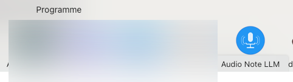

# Audio Note LLM

A desktop application for configuring and processing audio notes using Large Language Models. The application provides a user-friendly interface for selecting audio files, choosing processing actions, and editing prompt templates.

## Installation

Currently no package, you can build it from source.
For that on Mac:

- Clone the repository: `git clone https://github.com/megaproaktiv/audionote.git`
- Navigate to the project directory: `cd audionote`
- Install dependencies: `brew install go-task`
- Install the application: `task install`

## Authentication

Have a AWS profile configured with the necessary permissions.

## First start

Call 

## Configuration

Call 

Config Item | Description
--- | ---
S3 Bucket| a writeable Bucket in _the same region_. Check tries to access the bucket
AWS Profile | the configured AWS profile (e.g. with `aws configure --profile my-profile`)
Bedrock Modell | accessible model
Output File Path | Where results will be stored
Output Lines | The app output is shown in a window. Configure the number of lines to display.

## Configuration file

Will be created in the user's home directory `~/.config/audionote/config.yaml` on first start.

## Read also

- More in Access Keys [AWS IAM Credentials access keys](https://docs.aws.amazon.com/IAM/latest/UserGuide/id_credentials_access-keys.html)
- Bedrock Model [Access](https://docs.aws.amazon.com/bedrock/latest/userguide/model-access-modify.html)
